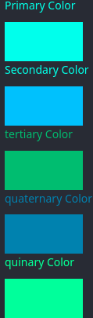

# dust

[nightly build](https://scintillating-hotteok-03eadd.netlify.app)

## Current Collor pallet

color pallet chosen with: [Adobe collor-wheel](https://color.adobe.com/create/color-wheel)

using [chart.js](https://vue-chart-3.netlify.app/guide/usage/) for the sensor charts.

[helper for charts.js](https://www.chartjs.org/docs/latest/samples/line/interpolation.html)
